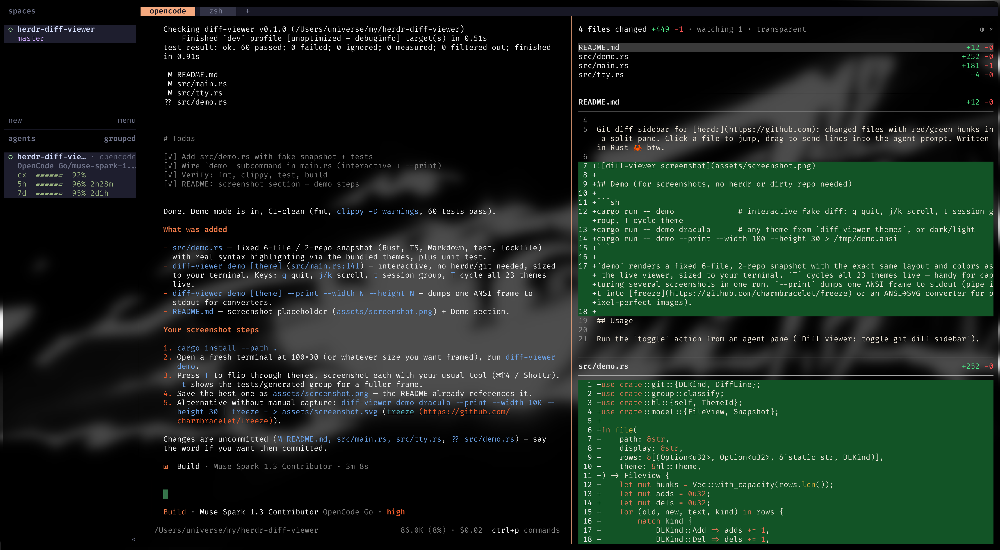

# diff-viewer

[](https://github.com/odiumuniverse/herdr-diff-viewer/actions/workflows/ci.yml)
[](LICENSE)


> ✨ Beautiful and ⚡ BLAZINGLY FAST ✨

Git diff sidebar for [herdr](https://github.com): changed files with red/green hunks in a split pane. Click a file to jump, drag to send lines into the agent prompt. Written in Rust 🦀 btw.



## Usage

Run the `toggle` action from an agent pane (`Diff viewer: toggle git diff sidebar`).

Scope is **per agent session**, not per tab or pane cwd: a repo enters the
scope after the session is observed working in it — a new process of the
session's tree runs with its cwd inside the repo, or the repo's working
tree changes while the session is alive. Neighbour repos (siblings of the
session's directories) and `DIFF_WATCH_ROOTS` roots (colon-separated) are
watched for changes too, so edits anywhere the agent writes are picked up
no matter the pane cwd. The pane's own cwd repo is never assumed — a
session that changed nothing there shows nothing from it, even if dirty.
Once a repo is in scope, all of its uncommitted changes are shown, whoever
made them. When the session ends (agent exits, session id changes,
pane/tab closes) its scope is deleted; a new session starts empty.
The viewer follows live while open, and background hooks (`pane.created` /
`pane.focused` / `pane.agent_status_changed`, plus `pane.closed` /
`pane.exited` / `tab.closed` for cleanup) keep tracking even while the viewer
is closed. The header shows `watching N` so you always know the blast radius.
Untracked files included. One broken repo never blanks the view.

Opt out of background tracking with `DIFF_TRACK=0`.

Toggle resyncs pane sizes after open/close (`resize --amount 0` is a no-op that still syncs pty winsizes), so neither the viewer nor the agent renders clipped until the next click.

## Theme

Click `◑` in the header or press `T` for a theme menu — applies instantly, persists across toggles. `j`/`k` + `Enter` to pick, `Esc` to close.

```sh
cargo install --path .     # once: `diff-viewer` in ~/.cargo/bin
diff-viewer themes         # list
diff-viewer theme NAME     # set from any shell, picked up live, no re-toggle
diff-viewer theme auto     # back to claude-code dark/light auto-detect
```

`transparent` = same syntax colors as `claude-code-dark`, but the gray base stays unpainted (your terminal background / blur shows through) with juicier reds and greens. Also available: `dark` / `light` (follow claude-code themes), or any name from `diff-viewer themes` (catppuccin, dracula, nord, gruvbox, one-dark/light, solarized, kanagawa, rose-pine, vesper, tokyo-night…). Unset = auto-detect from terminal background.

## Why not Claude Code `/diff`?

| | `/diff` | diff-viewer |
|---|---|---|
| Multi-repo scope | ❌ one repo | ✅ session-observed repos only |
| Live follow (1s) | ❌ snapshot | ✅ ticks while you work |
| Click-to-jump file list | ❌ | ✅ |
| Drag lines into prompt as `file:line` | ❌ | ✅ |
| Transparent theme | ❌ | ✅ 👻 |
| Speed | fast | ⚡ BLAZINGLY FAST (it's Rust 🦀) |
